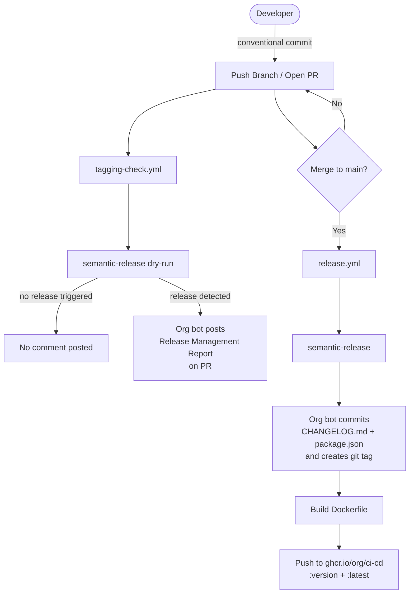

# CI-CD

Sandbox for CI/CD Frameworks

## CI/CD Flow



## Release Management

We utilize [Conventional Commits](https://www.conventionalcommits.org/) messages and automated tagging via [Semantic Versioning](https://semver.org/) for managing helm chart releases.

When making changes that affect the helm chart, use these prefixes:

- `fix:` represents bug fixes, correlates to a SemVer patch
  - Example: `fix: correct indentation in values.yaml`
- `feat:` represents a new feature, correlates to a SemVer minor
  - Example: `feat: add support for custom environment variables`
- Breaking changes (SemVer major) can be indicated in two ways:
  - `feat!:` or `fix!:` with the `!` indicating a breaking change
  - Adding `BREAKING CHANGE:` in the commit message footer
  - Example:

    ```text
    feat!: change default authentication method
    BREAKING CHANGE: Authentication now requires different configuration format
    ```

## Local Development

```sh
pip install -r requirements.txt
pre-commit install --hook-type commit-msg
```

Example of failure message when not following conventional commits

```log
[WARNING] Unstaged files detected.
[INFO] Stashing unstaged files to /Users/mini/.cache/pre-commit/patch1773584714-14376.
Conventional Commit......................................................Failed
- hook id: conventional-pre-commit
- exit code: 1

[Bad commit message] >> test
Your commit message does not follow Conventional Commits formatting
https://www.conventionalcommits.org/

Use the --verbose arg for more information

[INFO] Restored changes from /Users/mini/.cache/pre-commit/patch1773584714-14376.
```
